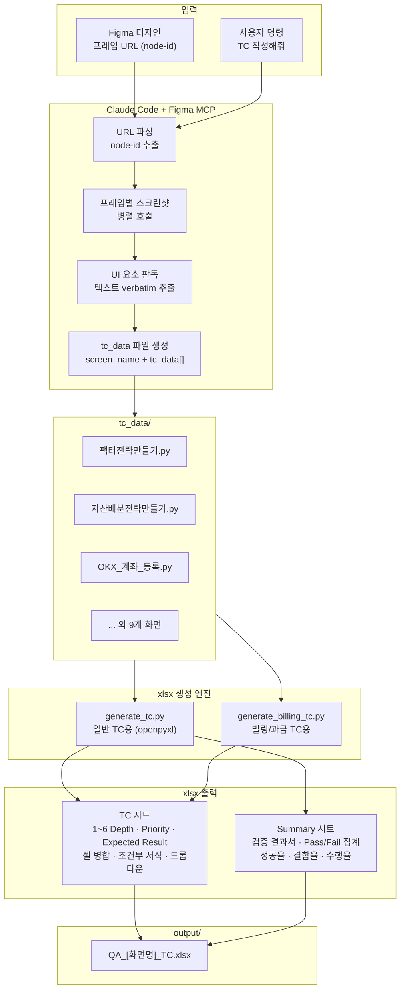

# TC Automation

Figma 디자인을 분석하여 QA 테스트 케이스(TC)를 자동 생성하고, 배포 전 체크리스트 양식의 xlsx 파일로 출력하는 자동화 도구입니다.
Claude Code + Figma MCP를 활용하여 디자인 스크린샷에서 UI 요소를 verbatim으로 추출하고, 계층형 TC 데이터를 구조화합니다.

## 핵심 기술 시연

| 영역 | 구현 내용 |
|------|---------|
| AI 디자인 분석 | Claude Code + Figma MCP로 프레임별 스크린샷 판독, UI 텍스트 verbatim 추출 |
| 엔진/데이터 분리 | generate_tc.py(xlsx 포맷) + tc_data/*.py(TC 내용) 완전 분리 구조 |
| xlsx 자동 생성 | openpyxl 기반 — 셀 병합, 조건부 서식, 데이터 유효성 검사, 자동 필터 |
| 검증 결과서 | Summary 탭 자동 생성 — Pass/Fail 집계, 성공율·결함율·수행율 수식 |
| 빌링 TC 엔진 | API 시나리오 기반 과금 테스트 전용 엔진 (generate_billing_tc.py) |
| 다중 화면 지원 | 화면별 독립 tc_data 파일 — 12개 화면 TC 작성 완료 |
| 우선순위 체계 | P1(핵심 기능) / P2(UI 검증) / P3(엣지 케이스) 3단계 분류 |

## 시스템 아키텍처



## TC 작성 워크플로우

```
[Figma URL 전달]  프레임 node-id 포함 URL 입력
       │
       ▼
[스크린샷 판독]   프레임별 병렬 호출 → UI 텍스트 verbatim 추출
       │          (추정 금지, 미확인 항목은 [확인 필요] 표기)
       ▼
[tc_data 생성]    tc_data/<화면명>.py 자동 생성
       │          (screen_name + tc_data 튜플 리스트)
       ▼
[xlsx 출력]       python generate_tc.py tc_data/<화면명>.py
       │
       ▼
[결과]            output/QA_[화면명]_TC.xlsx
```

## xlsx 출력 스펙

### TC 시트

| 열 | 헤더 | 비고 |
|----|------|------|
| A~F | 1~6 Depth | 계층형 시나리오 (연속 동일 값 자동 병합) |
| G | Priority | P1 / P2 / P3 |
| H | Expected Result | 사용자 관점 기대결과 |
| I | Android | 드롭다운: P / F / NA / NT |
| J | iOS | 드롭다운: P / F / NA / NT |
| K | Date | 검증 일자 |
| L | BTS ID | 이슈 트래킹 ID |
| M | 합계 | 우상단 Priority별 COUNTIF 집계 |

- `F` 입력 시 배경색 `#FFCCCC` 자동 적용 (조건부 서식)
- 행 4 기준 자동 필터 적용, freeze_panes = A5

### Summary 시트 (검증 결과서)

| 영역 | 내용 |
|------|------|
| 메타 정보 | 범위, Test App Ver., 결과보고일자, 검증자 |
| 집계 테이블 | 총 항목, Not Run, Pass, Fail, Block, N/T, NA, Run, 성공율, 결함율, 수행율 |
| 참고 및 특이사항 | 자유 기입 영역 |

## 작성 완료 화면 (12개)

| 파일 | 화면 |
|------|------|
| 팩터전략만들기.py | 팩터 전략 만들기 (4단계 + 완성) |
| 팩터전략_전략테스트.py | 팩터 전략 - 전략 테스트 |
| 자산배분전략만들기.py | 자산배분 전략 만들기 |
| 12개의전략.py | 12개의 전략 |
| 롱숏전략상세.py | 롱숏 전략 상세 |
| OKX_계좌_등록.py | OKX 계좌 등록 |
| 코인_계좌_상세_유료화.py | 코인 계좌 상세 유료화 |
| 사용권업그레이드.py | 사용권 업그레이드 |
| VIP_MO_상담신청.py | VIP MO 상담 신청 |
| 온보딩_닉네임_마케팅동의_v2.py | 온보딩/닉네임/마케팅 동의 |
| 온보딩_모의투자계좌.py | 온보딩 모의투자 계좌 |
| 홈_닉네임수정_마케팅동의.py | 홈 닉네임 수정/마케팅 동의 |

## 프로젝트 구조

```
tc-automation/
├── generate_tc.py              # 일반 TC용 xlsx 생성 엔진 (openpyxl)
├── generate_billing_tc.py      # 빌링/과금 TC용 xlsx 생성 엔진
├── tc_data/                    # 화면별 TC 데이터 파일
│   ├── 팩터전략만들기.py        #   screen_name + tc_data[] 구조
│   ├── 자산배분전략만들기.py
│   ├── OKX_계좌_등록.py
│   └── ... (12개 화면)
├── output/                     # 생성된 xlsx 파일 저장 위치
│   ├── QA_팩터 전략 만들기_TC.xlsx
│   └── ...
├── CLAUDE.md                   # Claude Code 동작 규칙 및 TC 작성 기준
└── README.md
```

## 사용법

### 요구사항

| 도구 | 확인 | 목적 |
|------|------|------|
| Python 3.x | `python --version` | 스크립트 실행 |
| openpyxl | `pip install openpyxl` | xlsx 생성 |
| Claude Code | Figma MCP 연결 | 디자인 분석 + TC 자동 생성 |

### TC 생성

```bash
# 단일 화면 TC xlsx 생성
python generate_tc.py tc_data/팩터전략만들기.py
# → output/QA_팩터 전략 만들기_TC.xlsx

# 빌링 TC xlsx 생성
python generate_billing_tc.py
# → output/QA_Bitget_OKX_유료화_과금_TC.xlsx
```

### Claude Code 명령어

| 명령어 | 설명 |
|--------|------|
| `TC 작성해줘` | Figma 화면 읽고 TC 생성 + xlsx 저장 |
| `TC xlsx로 뽑아줘` | xlsx 파일로 출력 |
| `커버리지 확인해줘` | 누락 TC 체크리스트 보고 |
| `P1만 뽑아줘` | 우선순위 P1 TC만 필터링 |

## 우선순위 기준

| 등급 | 기준 | 예시 |
|------|------|------|
| P1 | 화면 진입, 핵심 기능, 구매 플로우, 에러 처리 | 전략 저장, 결제 완료, 시장 선택 |
| P2 | UI 노출, 텍스트 정확성, 탭/필터 전환 | 뱃지 표시, 카드 정보, 스크롤 |
| P3 | 안내 문구, 엣지 케이스 | 세부 텍스트, 경계값 입력 |

## 기술 스택

| 카테고리 | 기술 |
|---------|------|
| 언어 | Python 3.x |
| xlsx 생성 | openpyxl |
| 디자인 분석 | Claude Code + Figma MCP |
| TC 데이터 | Python 모듈 (screen_name + tc_data[]) |
| 출력 포맷 | xlsx (배포 전 체크리스트 양식) |
